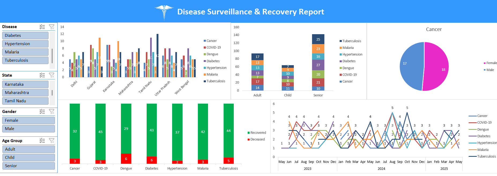

# 🧠 Disease Surveillance & Recovery Dashboard

## 🔥 Project Overview
An **Advanced Excel-based interactive healthcare dashboard** that visualizes disease surveillance data across multiple Indian states. This project enables users to track **patient distribution**, **recovery trends**, and analyze data by **gender**, **age group**, and **disease type** — all through an intuitive and dynamic interface. Built for **data-driven decision-making** in public health and epidemiology.

---

## 🚀 Key Features

- ✅ **Objective:** Developed a fully interactive Excel dashboard to monitor disease impact and recovery rates.  
- ✅ **Interactive Filters:** Enabled dynamic analysis through slicers for **Disease**, **State**, **Gender**, and **Age Group**.  
- ✅ **Technology Stack:**  
  - Microsoft Excel  
  - Pivot Tables  
  - Pivot Charts  
  - Slicers  
  - Conditional Formatting  
- ✅ **Visualizations Used:**  
  - Clustered Bar Charts  
  - Stacked Column Charts  
  - Pie Charts  
  - Time-Series Line Graphs  
- ✅ **Use Case:**  
  Ideal for **healthcare analysts**, **public policy professionals**, **NGOs**, and **students** studying **epidemiology** and **public health analytics**.

---

## 📌 How It Works

1. **Data Collection:** Compiled patient-level datasets across various diseases and Indian states.  
2. **Data Modeling:** Structured the data using Pivot Tables and connected them with interactive slicers.  
3. **Visualization:** Built dynamic charts to show disease distribution, gender-wise analytics, and recovery outcomes.  
4. **Interactive Dashboard:** Designed for real-time filtering and exploration for fast, actionable insights.

---

## 📷 Dashboard Preview

---

## ❓ Why This Project?

In the age of data-driven healthcare, **quick and intuitive visualization tools** are essential. However, many organizations **lack access to premium BI tools** like Power BI or Tableau.

This project shows how **Microsoft Excel** — a widely accessible and familiar tool — can be leveraged to:

- Build **insightful dashboards** without any coding.  
- Empower users to explore healthcare data easily and interactively.  
- Turn raw patient data into **actionable insights** for health interventions and planning.  
- Serve as a **cost-effective solution** for NGOs, government bodies, and academic institutions.

---

## 📥 How to Use

1. Clone the repo or download the `.xlsx` file.
2. Open it in Microsoft Excel.
3. Explore insights using available slicers.

---

## 📧 Contact

Feel free to reach out for feedback or collaborations!  
**Author**: Sarthak Salvi  
**Email**: [sarthaksalvi2107@gmail.com]

---

## ⭐️ Star this repo if you found it insightful!
